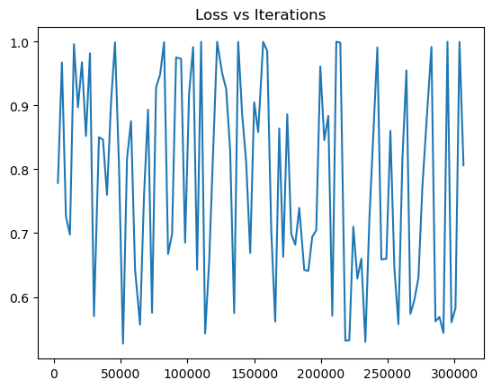

# <u>SAiDL Summer 2023 Induction Assignment Task-2 Computer Vision </u>   
## _Zero-Shot Segmentation using OpenAI's CLIP as an Encoder_   

## _Task_ -
### Create and train a decoder model on top of CLIP's encoder to segment images based on random image-text prompts. Had to try models of different complexities, different loss functions and use 2-3 evaluation metrics.   

## _Bonus task_ -
### Prove/Disprove the hypothesis - _"Pixel intensities in a grayscale image vary smoothly within an object, as opposed intensities from pixels that cross object boundaries or belong to different objects.”_, using statistical tests (like Welch's T-test).  

## _Approach :-_
## 1. Data -
The first task I did was to find a way to navigate the dataset and generate input-output pairs of image-masks. I extracted the data out of the huge json file using pandas, dropped un-necessary columns and made a custom mask generator [`ground_images.py`](/Desktop/SAiDL/SAiDL%20Summer%202023/Computer_Vision/ground_images.py) and stored them in a separate folders. 
### Eg - 
#### Prompt is "Red Cushions"
#### input

#### output

## 2. Models - 
Now I decided a basic model architecture (model0) that I tried out with all 3 loss functions and then picked the loss function from the [CLIPSeg paper](https://arxiv.org/pdf/2112.10003.pdf) (BCELoss) to try out with other models (model1, model2). Description of the models -
### **model0** - 
layers with FiLM Conditioning[3](#notes) = "all"  
layers extracted from CLIP = total 5, (2nd, 4th, 6th, 8th, 10th)   

Loss vs Epoch graph

Architecture

Over the iterations

**Input[4](#notes)** (Prompt - "Giraffe") 
 
**Epoch 1**  
 
**Epoch 2**  
 
**Epoch 3**  
 
**Epoch 4**  
 
**Epoch 5**  
 
**Epoch 6**  
 
**Epoch 7**  
 
**Epoch 8**  
 
**Epoch 9**  
 
**Epoch 10**  
 

  

### **model1** - (original CLIPSeg implementation)
layers with FiLM Conditioning[3](#notes) = final layer  
layers extracted from CLIP = total 3, (3rd, 6th, 9th)  

Loss vs Epoch graph

Architecture

Over the iterations

**Input** (Prompt - "Goat") 
 
**Epoch 1**  
 
**Epoch 2**  
 
**Epoch 3**  
 
**Epoch 4**  
 
**Epoch 5**  
 
**Epoch 6**  
 
**Epoch 7**  
 
**Epoch 8**  
 
**Epoch 9**  
 
**Epoch 10**  
 

  

### **model2** - 
layers with FiLM Conditioning[3](#notes) = "all"  
layers extracted from CLIP = total 4, (8th, 9th, 10th, 11th)  

Loss vs Epoch graph

Architecture

Over the iterations

**Input** (Prompt - "Goat") 
 
**Epoch 1**  
 
**Epoch 2**  
 
**Epoch 3**  
 
**Epoch 4**  
 
**Epoch 5**  
 
**Epoch 6**  
 
**Epoch 7**  
 
**Epoch 8**  
 
**Epoch 9**  
 
**Epoch 10**  
 

 

**Quantitative Results** - (On the validation set, after 10 epochs)
| Model | Pixel-by-Pixel Accuracy(%) | Dice Score(%) | IOU Accuracy(%) | Trainable parameters | Projected Dimension|
| :- | :-: | :-: | :-: | :-: | :-: | 
| model0 | 86.15869 | **24.86891** | 18.49219 | **3871425** | **128** |
| model1 | **86.20316** | 23.61466 | 17.79634 | 1128545 | 64 | 
| model2 | 86.20224 | 24.75474 | **18.49252** | 3179969 | **128** |
 

### **Qualitative Analysis** - 
There is <u>no significant difference</u> between the model performances (~<1% for all metrics) despite my model having about <u>_~2 million_</u> more parameters, I believe this is because CLIP's feature space is very rich and it captures the Dataset properly, so a simple decoder is more than adequate. I tried to make my model as complex as possible (model0) but I believe the CLIPSeg model would require maybe a small amount of extra training to reach similar performance while being light-weight during deployment. I would like to point out that My model's (model2) learning graph is much more smooth than other 2 models, convergence is evident. All 3 models predict very similar masks with some jitter.

### **A few Masks** - 

Example1

_Input_ (Prompt - "Airplane")  
  
_Output_ (order - model0 -> model1 -> model2)  
 
 
 

Example2

_Input_ (Prompt - "Mountains in the background")  
  
_Output_ (order - model0 -> model1 -> model2)  
 
 
 

Example3

_Input_ (Prompt - "Surfer with a blue surfboard")  
  
_Output_ (order - model0 -> model1 -> model2)  
 
 
 

Example4

_Input_ (Prompt - "stack of gifts")  
  
_Output_ (order - model0 -> model1 -> model2)  
 
 
 

Example5

_Input_ (Prompt - "Orange bus")  
  
_Output_ (order - model0 -> model1 -> model2)  
 
 
 

 

## 3. Comparing results from different Loss functions -
### a) Graphs -

 <b>BCEWithlogitsLoss</b> 

  

 <b>DICE score as Loss</b> 

  

 <b>Focal Loss</b> 

  

### b) <b>Quantitative Results</b> - (Using model0, on the validation set, after 10 epochs)
| Loss Function | Pixel-by-Pixel Accuracy(%) | Dice Score(%) | IOU Accuracy(%) |
| :- | :-: | :-: | :-: |
| BCEWithLogitsLoss | **86.15869** | 24.86891 | 18.49219 |
| Dice score as Loss| 81.48438 | **32.59544** | **23.69885** |
| Focal Loss | 82.56705 | 22.78004 | 16.82022 |
 

### c) <b>Qulaitative analysis</b> - 
1. From the graphs, clearly if Dice Loss is used we lose all information about convergence of the model, although it's masks are pretty good.
2. Dice Loss has the best masks and generalises very well to unknown prompts+images, because of it's inherent objective of maximisation of Dice Score whereas BCE focuses on individual pixels and Focal loss also has BCE (<u>extra focus on mis-classifed pixels</u>).
3. The CLIPSeg paper <u>still uses BCE</u>, this is most likely because with enough training, their <a href = "https://arxiv.org/pdf/2110.08322.pdf">performance converges</a>, + by 1, it is much more easy to control and check the progress of the model.
4. Combining my results and the paper referenced in 3, Dice Score + BCE would be the <u>best loss function</u> to use for semantic segmentation, combining explainability and generalisation.

[<b>Reference for loss functions' code</b>](https://github.com/shruti-jadon/Semantic-Segmentation-Loss-Functions/blob/master/loss_functions.py)
 

### d) <b>Over the Iterations </b> -
1. 

   
Focal Loss

    _Input (Prompt - "Giraffe")_ 
     
    _Epoch 1_ 
     
    _Epoch 2_ 
     
    _Epoch 3_ 
     
    _Epoch 4_ 
     
    _Epoch 5_ 
     
    _Epoch 6_ 
     
    _Epoch 7_ 
     
    _Epoch 8_ 
     
    _Epoch 9_ 
     
    _Epoch 10_ 
     
    _Output_ 
     
    

2. 

   
Dice Loss<a href = #notes>5</a>

   _Input (Prompt - "Truck")_ 
     
    _Epoch 1_ 
     
    _Epoch 2_ 
     
    _Epoch 7_ 
     
    _Epoch 10_ 
     
    _Output_ 
     
    

## 4. Visualising a few masks - 

Example 1

_Input (Prompt = "chocolate")_  

 
_Output (BCE -> DICE -> Focal)_  

 
 
 

Example 2

_Input (Prompt = "rug")_  

 
_Output (BCE -> DICE -> Focal)_  

 
 
 

Example 3

_Input (Prompt = "Skiing man")_  

 
_Output (BCE -> DICE -> Focal)_  

 
 
 

Example 4

_Input (Prompt = "catcher")_  

 
_Output (BCE -> DICE -> Focal)_  

 
 
 

Example 5

_Input (Prompt = "sign post")_  

 
_Output (BCE -> DICE -> Focal)_  

 
 
 

Example 6

_Input (Prompt = "planes")_  

 
_Output (BCE -> DICE -> Focal)_  

 
 
 

Example 7

_Input (Prompt = "bread")_  

 
_Output (BCE -> DICE -> Focal)_  

 
 
 

 

## _Bonus Part_ - 
| Dataset | t-value | degrees of freedom (DOF) |
| :------ | :-----: | :----------------------: |
| Validation | 3.803102 | 12843.217203 |
| Train | 6.235643 | 59410.942513 |
| t-value at ∞ DOF and 99.9% confidence interval[11](https://www.ttable.org) | 3.291 | - |
### For the bonus part, I believe that our hypothesis about variations in pixel intensities is <u>correct</u> (_“Pixel intensities in a grayscale image vary smoothly within an object, as opposed intensities from pixels that cross object boundaries or belong to different objects.”_), to prove this claim it is sufficient to show that the two populations[1](#notes) involved were from different distributions and this was clear from the results I got; from the Welch's T-test, I was able to conclude that the two populations have <u>different means</u> even at 99.9% confidence interval, therefore they are statistically very different and from different distributions; the code[2](#notes) is quite self explanatory.  

## _What I was able to learn_ - 
### I was able to learn a **LOT** about image segmentation, transfer learning, muti-modal learning, loss functions and pyTorch implementations.  

## _References[6](#notes)_ - 
1. [CLIPSeg paper + code](https://github.com/timojl/clipseg)
2. [Open AI's CLIP, connecting images and text](https://www.youtube.com/watch?v=fQyHEXZB-nM)
3. [HuggingFace version of CLIP](https://huggingface.co/docs/transformers/model_doc/clip)
4. [Robustness of Loss Functions](https://arxiv.org/pdf/2110.08322.pdf)
5. [FiLM](https://distill.pub/2018/feature-wise-transformations/)
6. [Code for loss functions](https://github.com/shruti-jadon/Semantic-Segmentation-Loss-Functions/blob/master/loss_functions.py)
7. [Dice Score](https://en.wikipedia.org/wiki/Sørensen–Dice_coefficient)
8. [IOU](https://medium.com/analytics-vidhya/iou-intersection-over-union-705a39e7acef)
9. [Focal Loss](https://www.youtube.com/watch?v=Y8_OVwK4ECk)
10. [Welch's T-test](https://en.wikipedia.org/wiki/Welch%27s_t-test)
11. [T-table](https://www.ttable.org)

## Notes -
1. the two Populations are _first, the **absolute pixel intensity differences between pixels belonging to the same object**, and the second, **absolute pixel intensity differences between pixels belonging to different objects**_.

2. I <u>did not</u> use my own decoder just to get better and accurate results for the hypothesis, my decoder has just been trained for 10 epochs, and would not predict very accurate masks.

3. About [FiLM](https://distill.pub/2018/feature-wise-transformations/) (Feature-wise Linear Modulation), it is nothing but just the projection of the text embedding onto the reduced dimension space (at-least in the current context).

4. The outputs are from when I used model0 with <u>Focal Loss</u> because my images for BCE Loss got corrupted.

5. "Over the iterations'" section of Dice Loss is <u>not at all indicative</u> of how the model is learning.

6. I may have provided links in the document but this is a consolidated list.