# SAiDL 2023 Induction Assignment Task-1 Core ML   

# Versions of SoftMax   

## <u>_Task(s)_</u>[1](#note) - In this task we were supposed to implement different versions of the SoftMax Activation and <u>compare</u> their running times, accuracy, precision, and other such metrics to evaluate it's performance on the CIFAR-100 dataset with the SAME base convolutional model for all versions.   

## <u>_Completed Task(s)_</u> - I implemented a base model with 3 conv layers and 2 fully connected layers, optimized by SGD; over which I was able to provide code for-  
### 1. Normal Softmax, this one also has a numpy[2](#note) code implementation apart from the pyTorch version, which is supported by cython files for fast implementations. (Source - [CS231n 2017 Assignments](http://cs231n.stanford.edu/2017/syllabus.html))  

### 2. Gumbel Softmax, this too is accompanied by a numpy[2](#note) implementation with a few modifications over the basic normal one.  

### 3. Hierarchical Softmax, this is a pure pyTorch implementation with a custom loss function and a tree-node structure; this one has way more parameters compared to other models because of added parameters in the Tree nodes(99 nodes * 100 per node) and so requires many more epochs(smaller in time) to reach comparable performance.  

### 4. Adaptive Softmax, this is also a pure pyTorch implementation, and I used pyTorch's in-built implementation of [Adaptive Softmax](https://pytorch.org/docs/stable/generated/torch.nn.AdaptiveLogSoftmaxWithLoss.html#:~:text=Adaptive%20softmax%20is%20an%20approximate,approximately%20follows%20the%20Zipf's%20law.). However this <u>fails to work well or be time-efficient</u> because Adaptive Softmax is more suited to situations with unequal distribution of output labels (like words) but in our case, CIFAR-100 has all 100 classes equally distributed so no matter how we split the data, we will incurr extra time.  

### 5. Bonus part, I made a Vision Transformer using pyTorch's [MultiheadedAttention](https://pytorch.org/docs/stable/generated/torch.nn.MultiheadAttention.html) module, using only Gumbel SoftMax because it gave the best results for CNNs.  

## <u>_Approach_</u> -

### I started in the order listed above because I believe it is the order of increasing complexity of implementation, the one that took me the most time is Hierarchical SoftMax because I implemented everything from scratch, the numpy implementations were also comparable. My usual process for each would be to go through it's paper briefly, look for more resources on youTube and code the same.  

## <u>_References_</u> - 

### Official Papers I read -
### 1. [Gumbel SoftMax](https://arxiv.org/pdf/1611.01144v5.pdf)
### 2. [Adaptive SoftMax](https://arxiv.org/pdf/1609.04309v3.pdf)

### Videos I watched - 
### 1. [Adaptive SoftMax crossminds.ai](https://crossminds.ai/video/rankmax-an-adaptive-projection-alternative-to-the-softmax-function-606fea6bf43a7f2f827c0db3/)
### 2. [Hierarchical SoftMax NPTEL](https://www.youtube.com/watch?v=ioe1eeEWU0I)

### Medium articles -
### 1. [Bonus Part](https://towardsdatascience.com/implementing-visualttransformer-in-pytorch-184f9f16f632)  

## <u>_Time Complexities w.r.t. number of classes_</u> - 
### Normal - O(num_classes) 
### Gumbel - O(num_classes)
### Hierarchical - O(log2(num_classes)), also here, we have clearly lost the speed-up from hierarchical softmax because the constant factor dominates for such a small number of classes (100), in case we had a vocabulary of a few million words, hierarchical softmax would beat the normal and gumbel convnets by a huge margin.
### Adaptive - If used properly it will be sub-linear in num_classes but for my case where all it's assumptions break down, I believe it is O(num_clusters*average(num_classes per cluter))  

## <u>_Epoch Times_</u> and <u>_Accuracy_</u> and various metrics' results are summarised below -  

### _Epoch times_   
1. Normal SoftMax - each epoch lasted 65.34760665893555s  
2. Gumbel SoftmMx - each epoch lasted 72.78400754928589s  
3. Hierarchical SoftMax - each epoch lasted 94.77085032463074s  
4. Adaptive SoftMax - each epoch lasted 90.80197658538819s  
5. Vision Transformer - each epoch lasted 632.0854979991913s  

### _Loss vs iterations_   
### Normal SoftMax
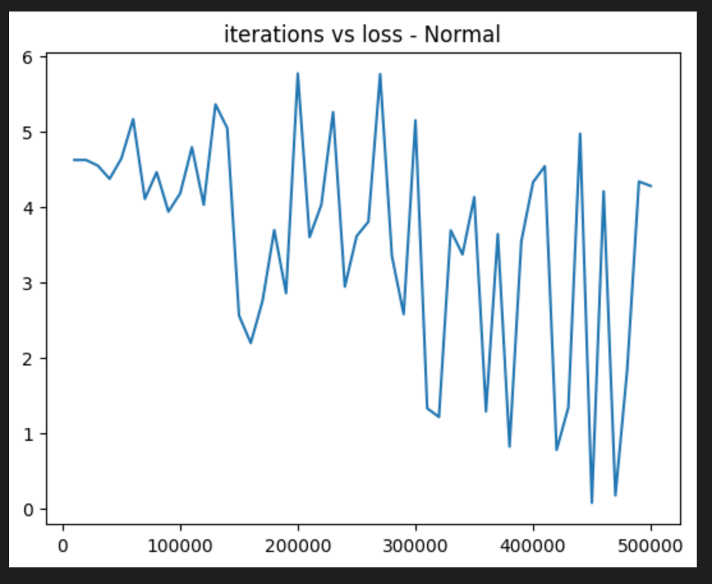   
### Gumbel SoftMax
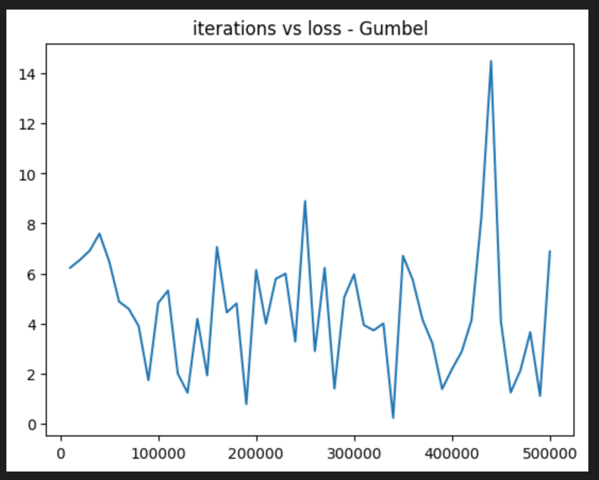   
### Hierarchical SoftMax
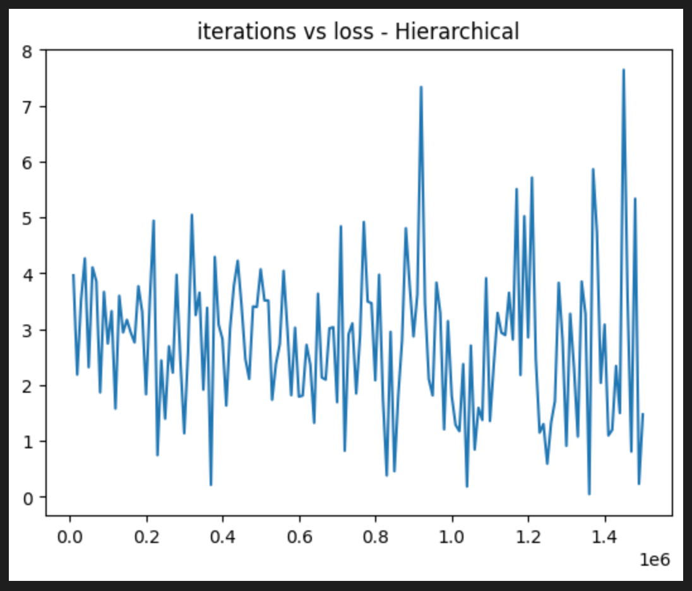   
### Adaptive SoftMax
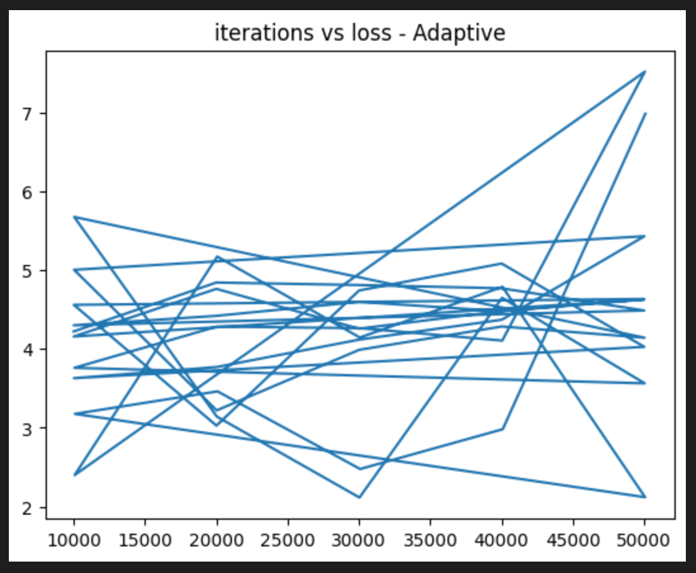   
### Vision Transformer -
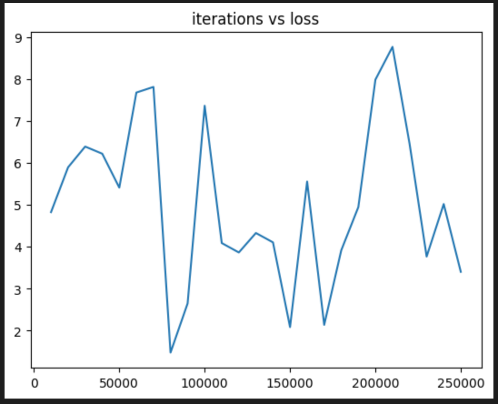  

### _Confusion matrices_   
### Normal SoftMax -
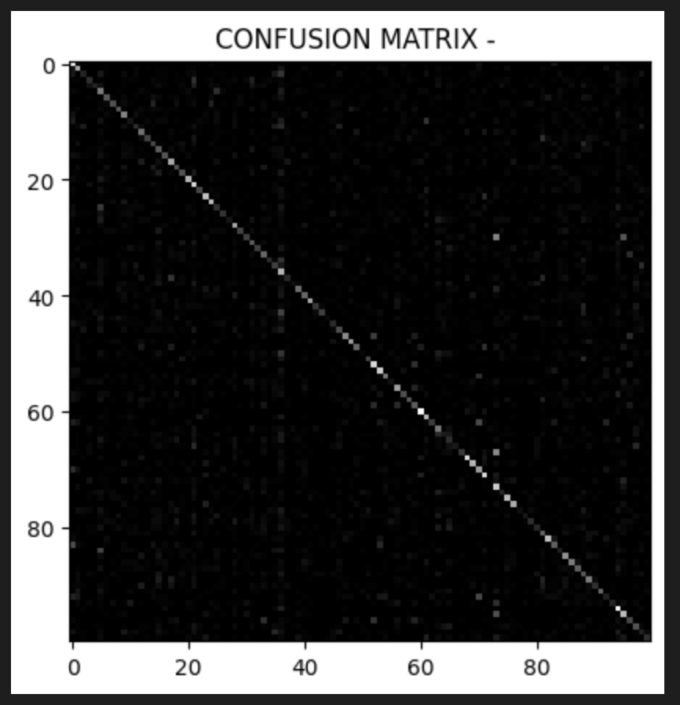   
### Gumbel SoftMax -
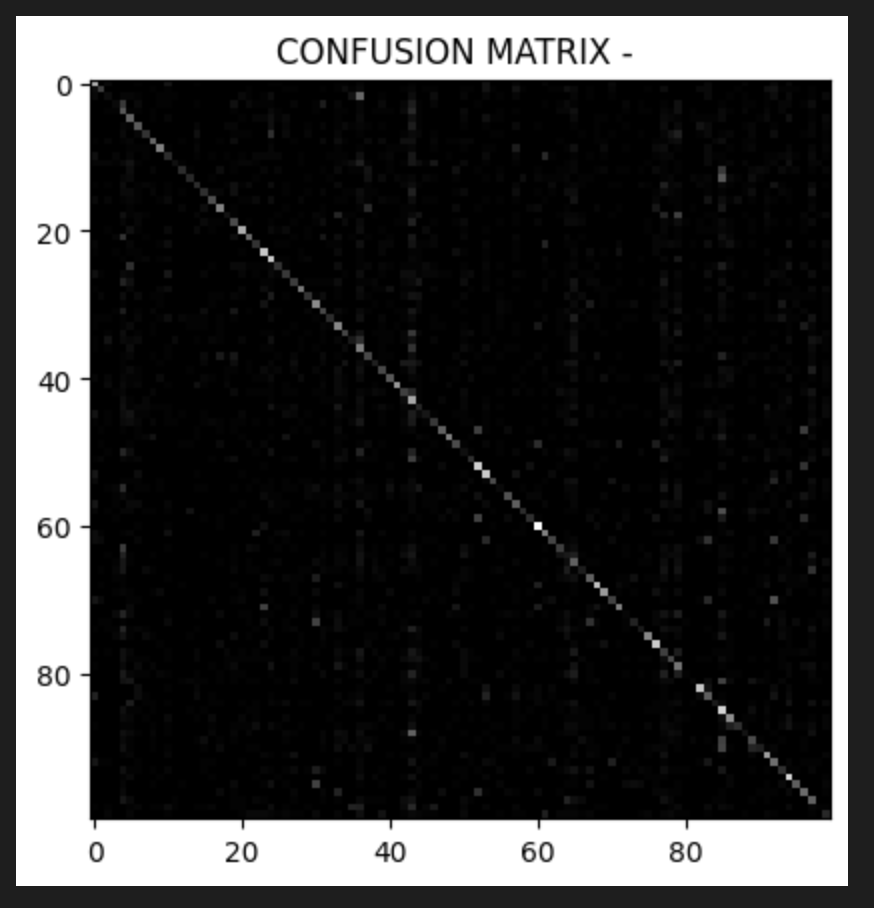   
### Hierarchical SoftMax -
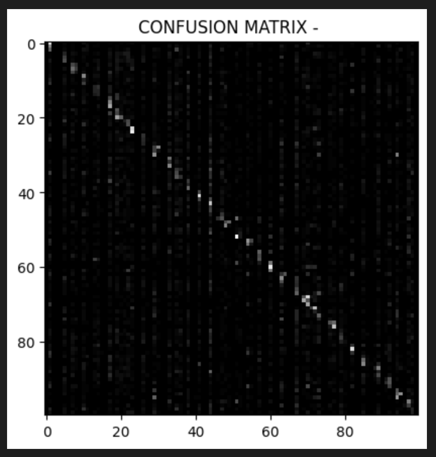   
### Adaptive SoftMax -
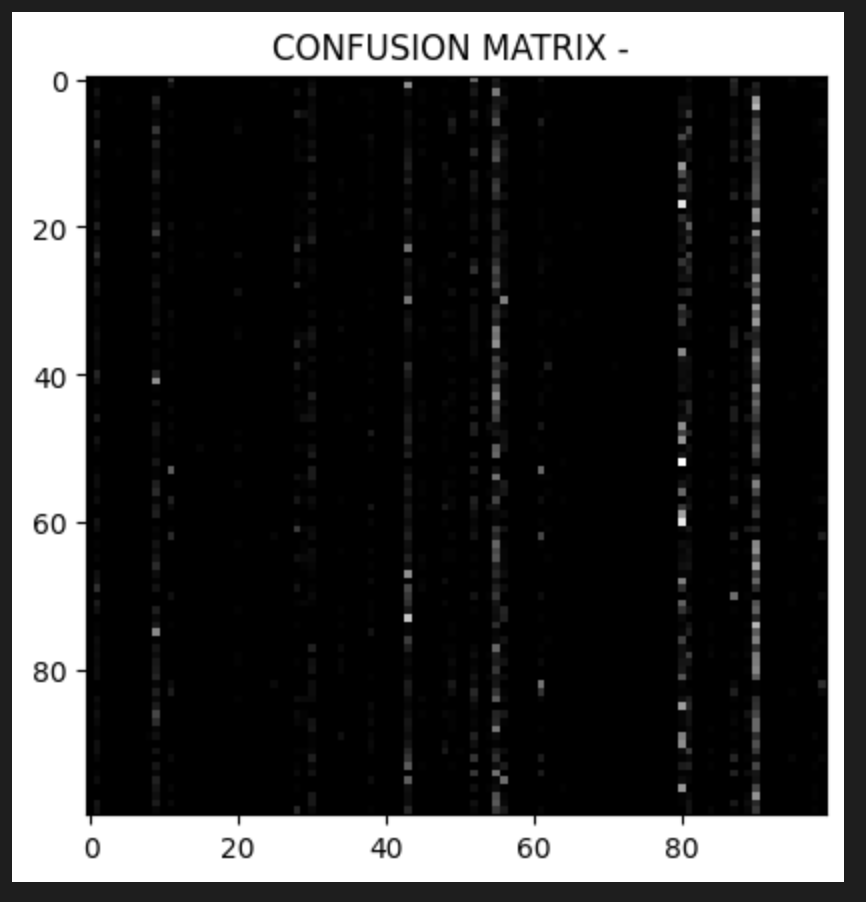   
### Vision Transformer -
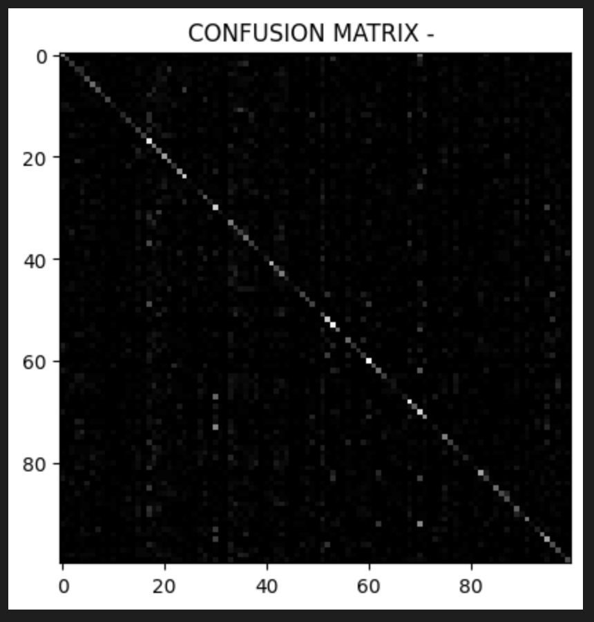   

### _Precision, recall and F1-score_ -  
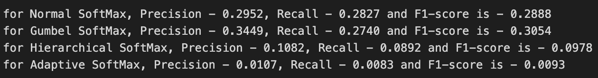   
### Bonus Part ~ Precision - 0.2180, Recall - 0.2146 and F1-score is - 0.2163  

### _Accuracies_ -
1. Normal SoftMax - 28.27% at 10 epochs  
2. Gumbel SoftMax - 27.4% at 10 epochs  
3. Hierarchical SoftMax - 8.92% at 30 epochs  
4. Adaptive SoftMax - 0.83% at 10 epochs  
5. ViT with Gumbel SoftMax - 21.46 % at 5 epochs  

## <u>_Observations and Inferences_</u> -
### <u>Gumbel softmax</u> (temperature close to 1 without annealing) works the best with comparable epoch time to normal softmax (<u>fastest</u>) getting the highest F1-score for same number of epochs accross all versions.
### I think this happens because with Gumbel SoftMax the model is trained to face a lot of randomness because of the noise, which is very much like DropOut, where any neuron may stop 'firing' at any momment and so the model has to sort of 'disperse' the information and becomes more robust.   

## <u>_Regarding the Bonus part_</u>-
### It helped me learn a lot about Vision Transformers, uptill now I had not used Transformer based networks for computer-vision related tasks, and getting some hands-on practice really helped; it also performed remarkably well, with 10 epochs a fairly small model could have definitely beaten the CNN; it is very computationally expensive(10x epoch time), but is is definitely learning much richer features that can be applied to downstream tasks.  

## _What I was able to learn_ - 
### I think the hierarchical softmax implementation really taught me a lot of stuff about auto-grad in pyTorch and it's work-arounds and the numpy implementations helped me understand the algorithms at the very basic level. This part definitely improved my coding capabilities for ML tasks. I also learnt some markdown language :p.  

### Notes - 
1. Numpy implementations are meant for python version 3.5.x (I have listed dependencies in the docs file), all other code works on the latest python version (3.11.x).
2. This task was meant as a comparative study and so I did not try to train the model(s) for unnecessarily long times because the results would have come out the same.