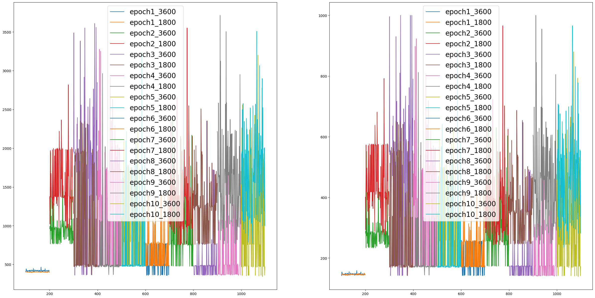
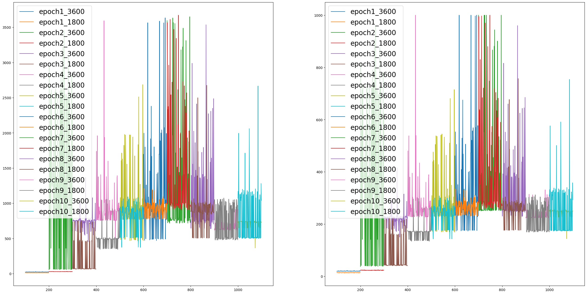
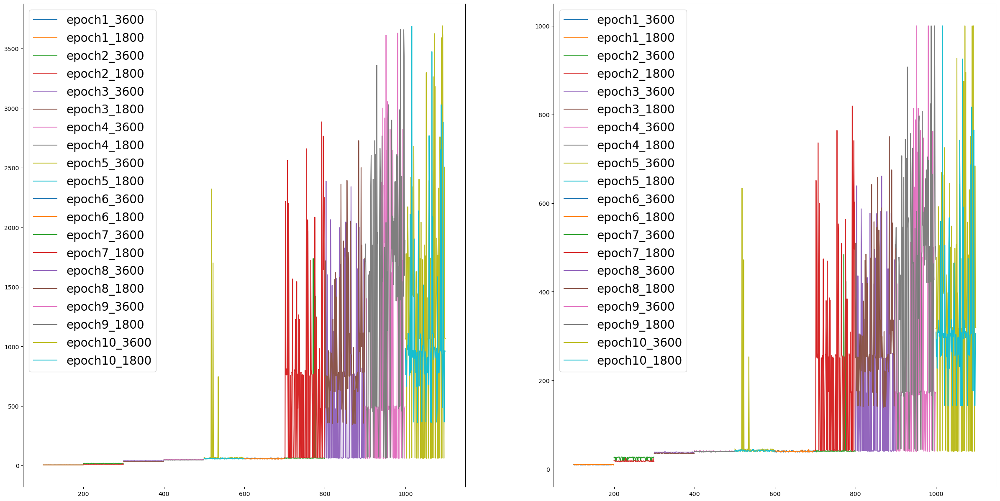
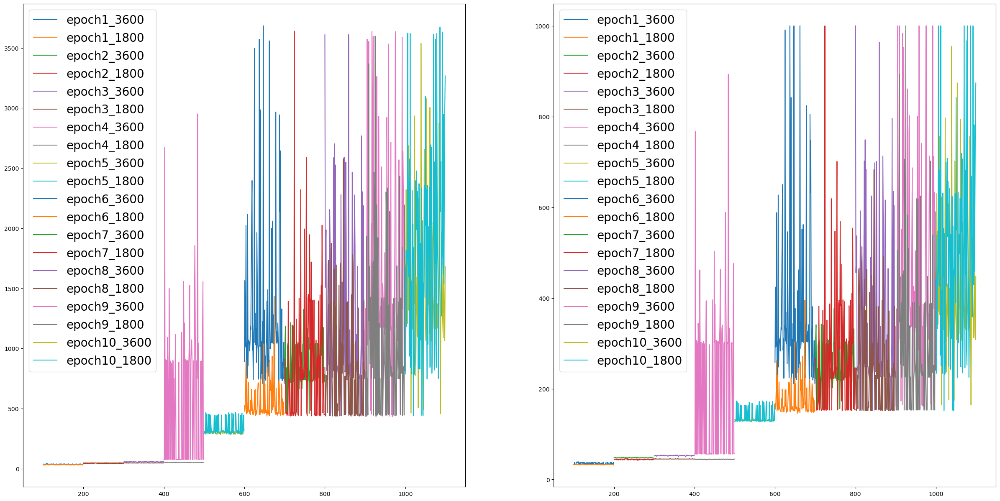
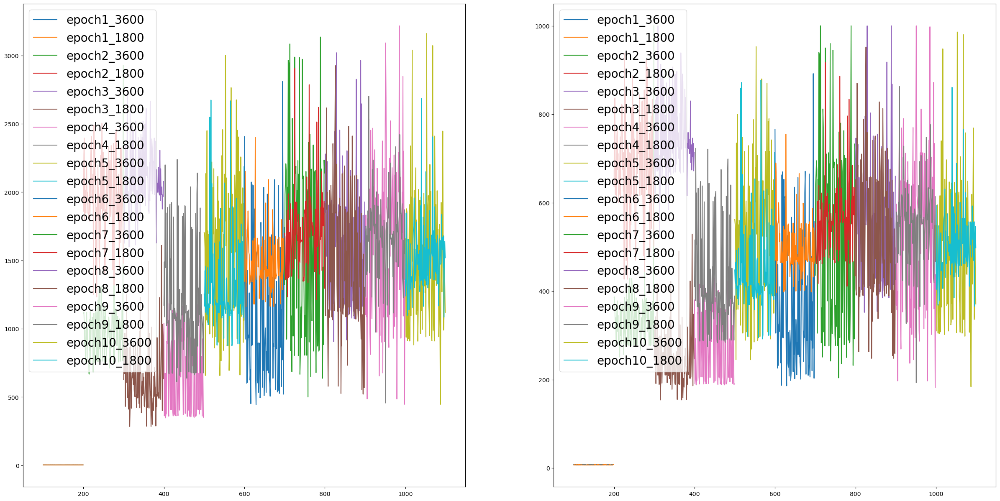
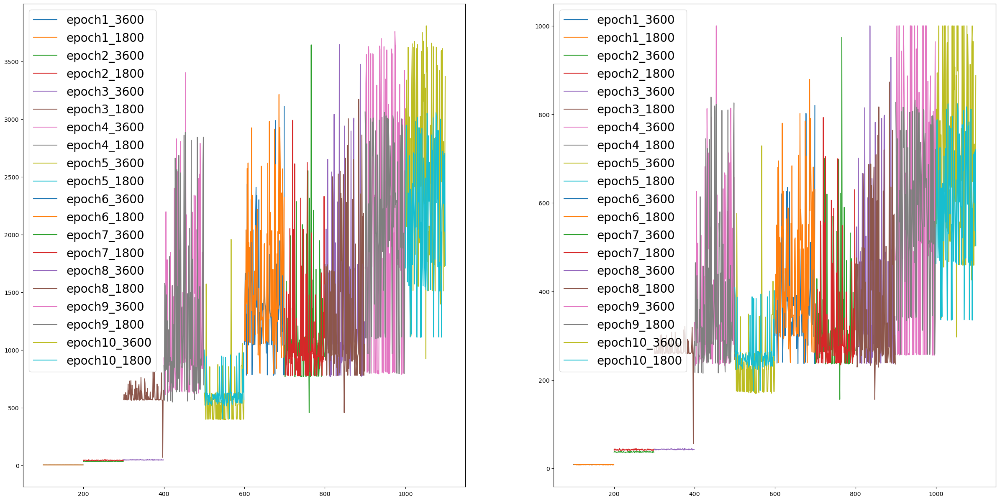
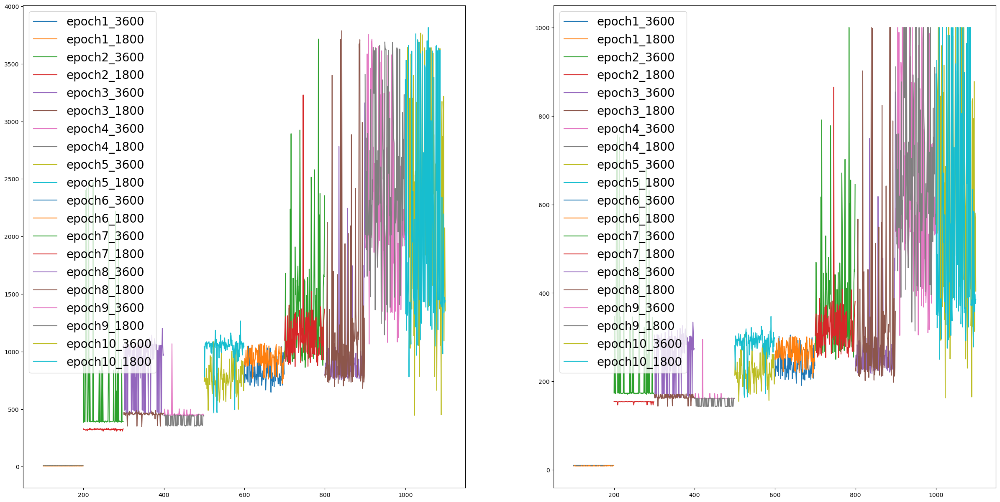

# SAiDL Summer 2023 Reinforcement Learning Task <br></br>

## _Task_ -
### Taking inspiration from the paper [Decision Transformer: Reinforcement Learning via Sequence Modeling](https://arxiv.org/abs/2106.01345), which uses transformers for RL, we had to use other sequential models and summarise the results.<br></br>

## _Implemented_ -
### I tried out all 3 basic RNNs, i.e. a LSTM, a GRU and an Vanilla RNN with the same hyperparameters and same training time.<br></br> 

## _A Brief Literature Review_ -
### This paper introduces a very novel method of formulating RL as a sequnce modelling problem, it **does not** adopt any typical modern-day RL techniques like policy gradients, temporal difference learning, etc. instead introduces transformers (inspired from their applications in other areas like vision and NLP) to tackle RL. They use offline RL with a novel quantity called ```returns-to-go``` after which a notion of time and sequentiality in the task becomes but obvious. They are able to compare with the State-of-the-art models on various baselines<sup>[1](#notes),[2](#notes)</sup> and even introduce a very strong baseline called %BC; also mentioned in the paper is how their models can **extrapolate**, i.e. <u>learn optimal strategies by observing sub-optimal behaviour</u>, how using returns-to-go, we can do (a limited form) of **multi-tasking** because with different <u>target returns</u> (initial value of returns-to-go) our model will end up learning different policies. They also show how because of the attention mechanism, their model is very resisistant to **long term credit assignment** tasks, and finally how giving unachievably high target returns leads to **stagnation** of the actual returns. I decided to include this because my analysis of the 3 RNNs will be based on these factors, i.e. **extrapolation**, **long term credit assignment** and **stagnation**. Other factors I have considered are, **stability of output**, **model complexity (number of parameters)**, **dataset used for training** and **mode of training (normal/delayed)<sup>[3](#notes)</sup>**.<br></br>

## _Hyperparameters_ - 
### 1. Learning Rate (10<sup>-3</sup>, I tried out different lrs and this worked the best)
### 2. Number of layers (2, chosen arbitrarily to keep model complexity minimum)
### 3. Optimizer (AdamW, chose this because used by the paper)
### 4. Projected dimension and Hidden dimension (128 and 64 respectively, once again from the paper<sup>[4](#notes)</sup>)
### 5. Context length (50, from the paper again<sup>[5](#notes)</sup>)
### 6. Number of episodes to evaluate on (100, from the paper)
### 7. Batch Size (256, from the paper) <br></br>

## _Quantitative Results<sup>[0](#notes)</sup>_ - 

0. [Reward Threshold](https://github.com/openai/gym/blob/master/gym/envs/__init__.py) - **3800**

1. Conditioned on target return 1800 

| RNN | Parameters | Expert(Best Mean Return, Std) | Medium(Best Mean Return, Std) | Expert-Delayed(Best Mean Return, Std)
| :-: | :-: | :-: | :-: | :-: | 
| Vanilla RNN | 151491 | 1677.6229 ± 546.7622 | - | 1415.0083 ± 727.4755 |
| GRU | 192963 | 1476.4826 ± 952.1141 | - | 1831.8598 ± 801.2214 | 
| LSTM | 213699 | 2166.6136 ± 565.3081 | 1964.6049 ± 294.4828 | 2545.4889 ± 697.9184 |

2. Conditioned on target return 3600

| RNN | Parameters | Expert(Best Mean Return, Std) | Medium(Best Mean Return, Std) | Expert-Delayed(Best Mean Return, Std)
| :-: | :-: | :-: | :-: | :-: | 
| Vanilla RNN | 151491 | 1588.3000 ± 895.70581 | - | 1422.7408 ± 871.3457 |
| GRU | 192963 | 1239.0831 ± 969.5796 | - | 1566.6688 ± 875.2072 |
| LSTM | 213699 | 2637.3236 ± 744.2742 | 2102.2708 ± 245.8621 | 2288.3606 ± 856.0474 |
<br></br>

## _Graphs<sup>[6](#notes)</sup>_ - (Left = Returns ; Right = Episode Lengths)
1. Vanilla RNN - Expert - Normal



2. Vanilla RNN - Expert - Delayed



3. GRU - Expert - Normal



4. GRU - Expert - Delayed



5. LSTM - Medium - Normal



6. LSTM - Expert - Normal



7. LSTM - Expert - Delayed


<br></br>

## _Qualitative Analysis_ -
### <u>First off</u>, all models when trained on the Expert dataset are able to achieve almost base-line performance, so even small scale models like these can be used as a replacement for a computation intensive Transformer for simple environments like Hopper. 
### <u>Second</u>, as expected LSTMs are pretty resistant to Long Term Credit Assignment (High mean returns and stable, low standard deviation), followed by GRUs (High mean returns but very unstable, large Standard deviations), and then Elman RNNs (which do not get high mean returns and are unstable).
### <u>Third</u>, Conditioning on 3600 leads to stagnation when trained on the Medium dataset, the LSTM extrapolates but not so much.
### <u>Fourth</u>, Almost all models extrapolate when conditioned on 1800 as the target return. (Here, what I mean from extrapolation is that it is able to achieve/beat the mean return of the dataset.)
### <u>Fifth</u>, My training time was very small, 10 epochs each of 100 iterations and a batch size of 256, and so these results can be immensly improved with better compute power (which I did not have access to).
### <u>Sixth</u>, I have found that these models are very finicky to initialization, and that some initializations learn very fast.<br></br>

## Note(s) - 

### 0. As this was a comparative study, I have not tried to go all out with the model training, but from the results it is already evident that performance would increase; and I have achieved sufficiently high performance.
### 1. Gym and,
### 2. Atari Baselines. (same as the paper)
### 3. In the normal mode, as a return is obtained the returns-to-go is decreased by that amount for the next cell; but in the delayed mode, the returns-to-go doesn't change till the last step (modelling sparse reward environments artificially).
### 4. The paper only has a Hidden Dimension as 128, no projected dimension is required because they use a transformer, in my case, projected dimension is the input to the RNN and Hidden Dimension is the size of the hidden state.
### 5. I could have experimented with this, but I think that other aspects of the paper were more important and they showed that performance <u>strongly</u> detiriorates with decreasing context length, so I kept this fixed.
### 6. A bit messy to observe on-the-fly but are pretty clear if observed properly.
